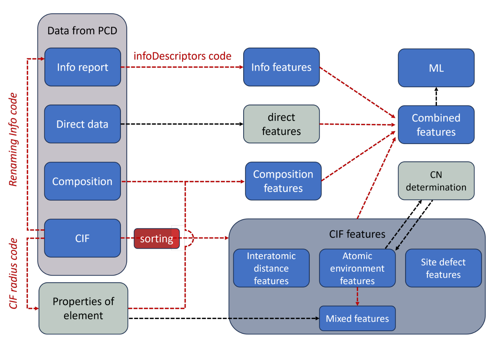

# CIF Coordination Number Featurizer



The CIF File Featurizer is a Python script designed to process CIF (Crystallographic Information File) files and extract various features from them. These features include interatomic distances, atomic environment information, and coordination numbers. The script can handle binary and ternary compounds.

## Features
- Process CIF files to extract structural information.
- Calculate interatomic distances between atoms.
- Extract atomic environment information using Wyckoff positions.
- Calculate coordination numbers for each atom.
- Save extracted features to CSV files for further analysis.

## Prerequisites
Before running the script, make sure you have the following dependencies installed:

- Python 3.x
- Click (Python package)
- Pandas (Python package)
- Gemmi (Python package)

You can install these dependencies using pip:

```bash
pip install click pandas gemmi
```

To run

```python
python main.py
```

## Contributors
- Anton Oliynyk
- Arnab Dutta
- Nikhil Kumar Barua
- Nishant Yadav
- Sangjoon Bob Lee
- Siddha Sankalpa Sethi


## Publications 
Here is a list of publications that have used this code for analysis

[1] Y. Tyvanchuk, V. Babizhetskyy, S. Baran, A. Szytula, V. Smetana, S. Lee, A. O. Oliynyk, A.
Mudring, The crystal and electronic structure of RE23Co6.7In20.3 (RE = Gd–Tm, Lu): A new structure type based on intergrowth of AlB2- and CsCl-type related slabs. *Journal of Alloys and Compounds*. **976**, 173241 (2024). [doi.org/10.1016/j.jallcom.2023.173241](https://doi.org/10.1016/j.jallcom.2023.173241)

