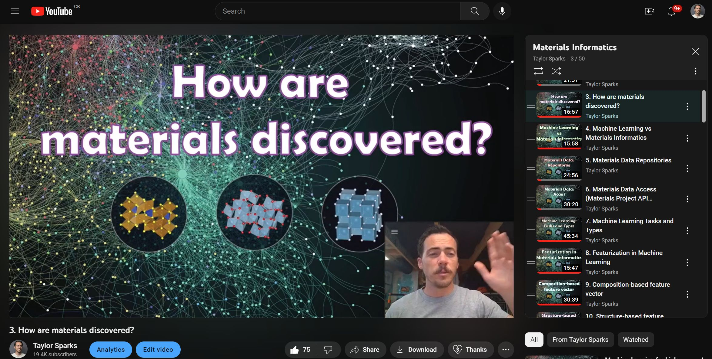

# MaterialsInformatics
MSE5540/6640 Materials Informatics course at the University of Utah

This github repo contains coursework content such as class slides, code notebooks, homework assignments, literature, and more for MSE 5540/6640 "Materials Informatics" taught at the University of Utah in the Materials Science & Engineering department. 

Below you'll find the approximate calendar for Spring 2024 and videos of the lectures are being placed on the following YouTube playlist
https://youtube.com/playlist?list=PLL0SWcFqypCl4lrzk1dMWwTUrzQZFt7y0

| month | day | Subject to cover                                                                          | Assignment                                                                                                                  | Link                          |
|-------|-----|-------------------------------------------------------------------------------------------|-----------------------------------------------------------------------------------------------------------------------------|-------------------------------|
| Jan   | 9  | Syllabus. What is machine learning? How are materials discovered?                         |  Install software packages together in class                                                                                                                           |                               |
| Jan   | 11  | Machine Learning vs Materials Informatics, In class example of fitting Hall-Petch data with linear model                    | Read 5 High Impact Research Areas in ML for MSE (paper1), Read ISLP Chapter 3, but especially Section 3.1                                  | [paper1](https://doi.org/10.1021/acs.chemmater.9b04078), [ISLP](https://www.statlearning.com/)               |
| Jan   | 16  | Materials data repositories, get pymatgen running for everybody, examples of MP API, MDF, NOMAD, others           | Create a new env and make sure you can get the notebooks in the "worked examples/MP_API_example" and "worked examples/foundry" folders running. | [Materials Project API](https://next-gen.materialsproject.org/api)                      |
| Jan   | 18  | Machine Learning Tasks and Types, Featurization in ML, Composition-based feature vector   | Read Is domain knowledge necessary for MI (paper1). Make sure you can get the CBFV_example notebook running in the ""worked examples/CBFV_example" folder                                                                          | [paper1](https://doi.org/10.1007/s40192-020-00179-z)                       |
| Jan   | 23  | Classification and cross-validation | Read ISLP Sections 4.1-4.5 and Section 5.1. Run through classification notebook| [ISLP](https://www.statlearning.com/)|
| Jan   | 25  | Structure-based feature vector, crystal graph networks, SMILES vs SELFIES, 2pt statistics | read selfies (paper1), two-point statistics (paper2) and intro to graph networks (blog1)                                    | [paper1](https://doi.org/10.1088/2632-2153/aba947), [paper2](https://linkinghub.elsevier.com/retrieve/pii/S1359645408004886), [blog1](https://distill.pub/2021/gnn-intro/)         |
| Jan   | 30  | Simple linear/nonlinear models. test/train/validation/metrics                             | Read linear vs non-linear (blog1), read best practices (paper1), benchmark dataset (paper2), and loco-cv (paper3). | [blog1](https://statisticsbyjim.com/regression/choose-linear-nonlinear-regression/), [paper1](https://doi.org/10.1021/acs.chemmater.0c01907), [paper2](https://doi.org/10.1038/s41524-020-00406-3), [paper3](https://doi.org/10.1039/C8ME00012C) |
| Feb   | 1  | in-class examples of featurization                             | Run through 2pt statistics, GridRDF, CBFV notebooks |HW1 due!  |
| Feb   | 6   | ensemble models, ensemble learning                                                  | Read ensemble (blog1), and ensemble learning (paper1)                                                                                       |[blog1](https://towardsdatascience.com/ensemble-methods-bagging-boosting-and-stacking-c9214a10a205),  [paper1](https://doi.org/10.1007/s40192-020-00178-0)                  |
| Feb   | 8   | Extrapolation, support vector machines, clustering                                              | Read extrapolation to extraordinary materials (paper1), clustering (blog1) , SVMs (blog2)                     | [paper1](https://doi.org/10.1016/j.commatsci.2019.109498), [blog1](https://towardsdatascience.com/how-exactly-umap-works-13e3040e1668),  [blog2](https://towardsdatascience.com/the-complete-guide-to-support-vector-machine-svm-f1a820d8af0b)      |
| Feb   | 13   | Artificial neural networks                                                                | Read the introduction to neural networks (blog1, blog2)                                                                     | [blog1](https://towardsdatascience.com/machine-learning-for-beginners-an-introduction-to-neural-networks-d49f22d238f9), [blog2](https://towardsdatascience.com/a-gentle-introduction-to-neural-networks-series-part-1-2b90b87795bc)                  |
| Feb   | 15  | Advanced deep learning (CNNs, RNNs)                                                       | HW2 due. Read…                                                                                                              | [blog1](https://towardsdatascience.com/a-comprehensive-guide-to-convolutional-neural-networks-the-eli5-way-3bd2b1164a53), [blog2](https://towardsdatascience.com/a-comprehensive-guide-to-convolutional-neural-networks-the-eli5-way-3bd2b1164a53)                  |
| Feb   | 20  | Transformers                                                                              | Read the introduction to transformers (blog1, blog2)                                                                        | [blog1](https://medium.com/inside-machine-learning/what-is-a-transformer-d07dd1fbec04), [blog2](https://towardsdatascience.com/illustrated-guide-to-transformers-step-by-step-explanation-f74876522bc0)                  |
| Feb   | 22  | Generative ML: Generative Adversarial Networks and variational autoencoders               | Read about VAEs (blog1, blog2, repo1) and GANS ()                                                                           | [blog1](https://visualstudiomagazine.com/articles/2021/05/06/variational-autoencoder.aspx?m=1), [blog2](https://debuggercafe.com/getting-started-with-variational-autoencoder-using-pytorch/), [repo1](https://github.com/AntixK/PyTorch-VAE)           |
| Feb    | 27  | Diffusion models and Image segmentation| Read U-net (paper1) and nuclear forensics (paper2)                                                                                                                         |   [CrysTens repo](https://github.com/michaeldalverson/CrysTens)                        |
| Feb    | 29  | Image segmentation part 2 and in-class coding examples | Download CrysTens github repo, read Segment Anything Model (paper 3)                                                                                                                         |   [paper1](https://arxiv.org/pdf/1505.04597.pdf), [paper2](https://doi.org/10.1016/j.jnucmat.2019.01.042), [paper3](https://arxiv.org/abs/2304.02643)                            |
| Mar   | 5  | NO CLASS, spring break |||
| Mar   | 7  | No CLASS, spring break |||
| Mar   | 12  | Bayesian Inference                                                                        | Read the introduction to Bayesian (blog1), go through Naive Bayes notebook                                                                          | [blog1](https://distill.pub/2019/visual-exploration-gaussian-processes/)                        |
| Mar   | 14  | Gaussian Processes                        |       |                              |
| Mar   | 19  | Bayesian Optimization                        |       |                              |
| Mar   | 21  | Self Driving labs part 1                        |       |                              |
| Mar   | 26  | Self Driving labs part 2                        |       |                              |
| Mar   | 28   | Large Language Models part 1                                                          | TBD                                                                     | TBD                           |
| Apr   | 2   | Large Language Models part 2                                                          | TBD                                                                     | TBD                           |
| Apr   | 4   | TBD                                                          | TBD                                                                                                                         | TBD                           |
| Apr   | 9  | Case study: Element Mover’s Distance, Mat2Vec                                             | Read Element mover’s distance (paper1) and Mat2Vec (paper2)                                                                 | [paper1](https://doi.org/10.1007/s40192-021-00242-3), [paper2](https://chemrxiv.org/engage/api-gateway/chemrxiv/assets/orp/resource/item/61232ed2ded28ab922866adb/original/comparing-transfer-learning-to-feature-optimization-in-microstructure-classification.pdf)                |
| Apr   | 11  | Case study: CrabNET vs Roost                                                              | Read CrabNet (paper1) and Roost (paper2)                                                                                    | [paper1](https://doi.org/10.1038/s41524-021-00545-1), [paper2](https://doi.org/10.1038/s41467-020-19964-7)                |
| Apr   | 16  | Case study: Superhard materials, structure prediction                                     | Read superhard (paper1), and structure prediction papers (paper2)                                                           | [paper1](https://doi.org/10.1021/jacs.8b02717), [paper2](https://doi.org/10.1021/acs.chemmater.7b05304)                |
| Apr   | 18  | Case study: CGCNN vs MEGNET vs SchNET                                                     | Read CGCNN (paper1), MegNET (paper2), SchNET (paper3)                                                                       | [paper1](https://doi.org/10.1103/PhysRevLett.120.145301), [paper2](https://doi.org/10.1021/acs.chemmater.9b01294), [paper3](https://arxiv.org/abs/1706.08566)        |
| Apr   | 20  | Case study: Cococrab, BRDA                                                                | HW4 due. Read Cococrab (paper1) and BRDA (paper2)                                                                           | [paper1](https://doi.org/10.1007/s40192-021-00242-3), [paper2](https://chemrxiv.org/engage/api-gateway/chemrxiv/assets/orp/resource/item/61232ed2ded28ab922866adb/original/comparing-transfer-learning-to-feature-optimization-in-microstructure-classification.pdf)                |

|       |     |                                                                                           |                                                                                                                             |                               |

I can recommend the book Introduction to Machine Learning found here https://www.statlearning.com/
